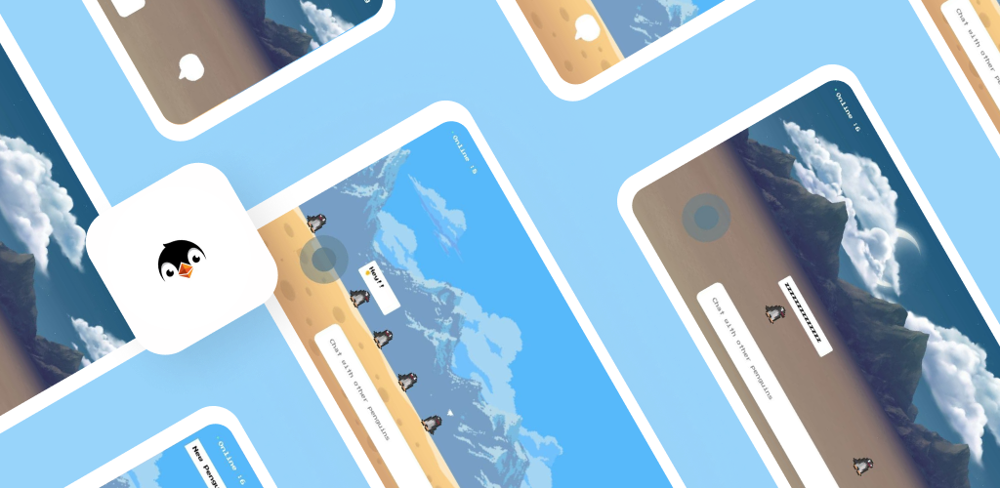
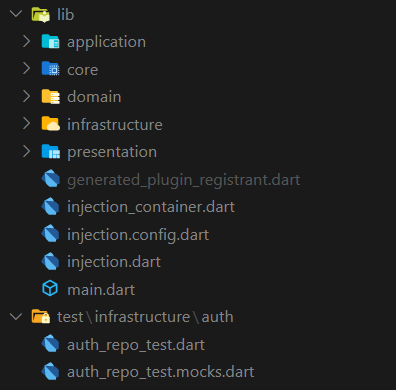

[](https://pub.dev/packages/fancy_text_reveal)   
[](https://github.com/Shadow60539/club_penguin_game/actions/workflows/test.yml)

# Club Penguin 



[](https://play.google.com/store/apps/details?id=com.sanjeev.penguin_chat_game)

### Introduction 🚀

> Club Penguin
A multiplayer game involving penguins and anonymous chat in a virtual 2D world

Before we start, you can take a look at the app:


### Usage 🎨

To clone and run this application, you'll need [git](https://git-scm.com) and [flutter](https://flutter.dev/docs/get-started/install) installed on your computer. From your command line:

```bash
# Clone this repository
$ git clone https://github.com/Shadow60539/social_media_game.git

# Go into the repository
$ cd social_media_game.git

# Install dependencies
$ flutter packages get

# Run the app
$ flutter run
```


### Packages 📦


Some very good packages are used in this project.


Package | Description
---|---
[flame](https://pub.flutter-io.cn/packages/flame) | A minimalistic Flutter game engine
[firebase_auth](https://pub.flutter-io.cn/packages/firebase_auth) | Firebase Authentication
[firebase_core](https://pub.flutter-io.cn/packages/firebase_core) | To use the Firebase Core API
[firebase_database](https://pub.flutter-io.cn/packages/firebase_database) | Firebase Realtime Database 
[dartz](https://pub.flutter-io.cn/packages/dartz) | Support functional programming in Dart
[build_runner](https://pub.flutter-io.cn/packages/build_runner) | Build Custom Models
[flutter_bloc](https://pub.flutter-io.cn/packages/flutter_bloc) | BLoC State Management
[flutter_launcher_icons](https://pub.flutter-io.cn/packages/flutter_launcher_icons) | Replace launcher icon
[freezed](https://pub.flutter-io.cn/packages/freezed) | Code generation for immutable classes
[google_fonts](https://pub.flutter-io.cn/packages/google_fonts) | Support google fonts
[injectable](https://pub.flutter-io.cn/packages/injectable) | Dependency injection
[lint](https://pub.flutter-io.cn/packages/lint) | Rules handler for Dart
[lottie](https://pub.flutter-io.cn/packages/lottie) | Lottie files animations
[mockito](https://pub.flutter-io.cn/packages/mockito) | Mock library for Dart
[provider](https://pub.flutter-io.cn/packages/provider) | Provider State Management

### Directory Structure 🏢

The project directory structure is as follows:

```
├── android
├── asset
├── build
├── images
├── ios
├── lib
├── test
├── analysis_options.yaml
├── pubspec.lock
├── pubspec.yaml

```




Directory | Description
---|---
application | State management layer
core | Core files which depend on all these layers
domain | Model and contract layer
infrastructure | Data layer
presentation | Widget layer
